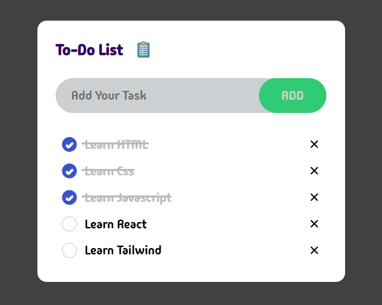

# To-Do List Web Application

This is a simple To-Do List web application built using HTML, CSS, and JavaScript. It allows users to add tasks, mark them as complete, and remove them from the list. You can view the Weather Card project live [here](https://rahulkumar129.github.io/Weather-Card/).

## Features

-   **Add Task**: Users can input their tasks in the provided text field and click the "ADD" button to add them to the list.
-   **Mark Task as Complete**: Each task has a checkbox. By clicking on the checkbox, users can mark the task as complete.
-   **Remove Task**: Users can remove a task from the list by clicking on the cancel icon next to the task.

## Technologies Used

-   **HTML**: Markup language used for structuring the web page.
-   **CSS**: Stylesheet language used for styling the web page.
-   **JavaScript**: Programming language used for implementing dynamic behavior, such as adding and removing tasks.

## File Structure

-   `index.html`: Main HTML file containing the structure of the web page.
-   `style.css`: CSS file containing the styles for the To-Do List.
-   `extra.css`: Additional CSS file for handling the animations.
-   `script.js`: JavaScript file containing the logic for adding and removing tasks.

## Getting Started

To run this project locally, follow these steps:

1. Clone the repository to your local machine:
2. Open the `index.html` file in your web browser.

## How to Use

1. Enter a task in the input field labeled "Add Your Task".
2. Press the "ADD" button or press the "Enter" key.
3. The task will be added to the list.
4. To mark a task as complete, click on the checkbox next to it.
5. To remove a task, click on the cancel icon next to it.

## License

This project is licensed under the MIT License. See the [LICENSE](LICENSE) file for details.

## Contributors

-   [Rahul](https://github.com/rahulkumar129) - [@Rahul187379](https://twitter.com/@Rahul187379)

## Issues and Feedback

If you encounter any issues or have any feedback or suggestions for improvement, please [open an issue](https://github.com/yourusername/weather-card-project/issues) on GitHub. We welcome contributions and feedback from the community.

## Contact

For any inquiries or further information, please contact [rahulkumardev129@gmail.com](mailto:rahulkumardev129@gmail.com).
